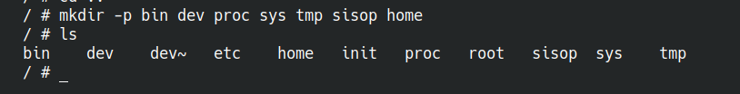
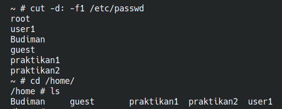
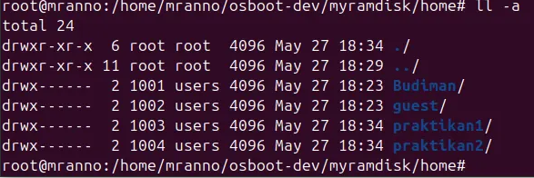
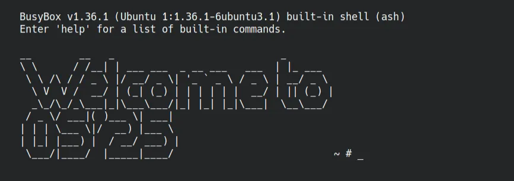
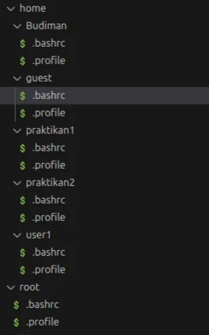
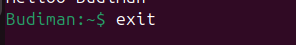
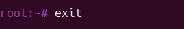
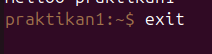

[](https://classroom.github.com/a/Eu-CByJh)
| NRP | Name |
| :--------: | :------------: |
| 5025201055 | SAMUEL BERKAT HULU |
| 5025241019 | Jahhaza Assiqooyah |
| 5025241023 | Hamzah Ali Abdillah |
| 5025241031 | Qurrata A`yun Kamil |


# Praktikum Modul 3 *(Module 3 Lab Work)*

### Laporan Resmi Praktikum Modul 3 *(Module 3 Lab Work Report)*

Di suatu pagi hari yang cerah, Budiman salah satu mahasiswa Informatika ditugaskan oleh dosennya untuk membuat suatu sistem operasi sederhana. Akan tetapi karena Budiman memiliki keterbatasan, Ia meminta tolong kepadamu untuk membantunya dalam mengerjakan tugasnya. Bantulah Budiman untuk membuat sistem operasi sederhana!

*One sunny morning, Budiman, an Informatics student, was assigned by his lecturer to create a simple operating system. However, due to Budiman’s limitations, he asks for your help to assist him in completing his assignment. Help Budiman create a simple operating system!*

### Soal 1

> Sebelum membuat sistem operasi, Budiman diberitahu dosennya bahwa Ia harus melakukan beberapa tahap terlebih dahulu. Tahap-tahapan yang dimaksud adalah untuk mempersiapkan seluruh prasyarat dan melakukan instalasi-instalasi sebelum membuat sistem operasi. Lakukan seluruh tahapan prasyarat hingga perintah ini pada modul!
> 

> Before creating the OS, Budiman was informed by his lecturer that he must complete several steps first. The steps include preparing all prerequisites and installing before creating the OS. Complete all the prerequisite steps up to this command in the module!
> 

**Answer:**

```bash
qemu-system-x86_64 -smp 2 -m 256 -display curses -vga std -kernel bzImage -initrd myramdisk.gz -append 'console=ttyS0'

qemu-system-x86_64 -smp 2 -m 256 -monitor /dev/null  -kernel bzImage -initrd myramdisk.gz -append 'console=ttyS0 loglevel=3' -no-reboot -nographic
```

- **Code:**
    
    ```bash
    #!/bin/sh
    /bin/mount -t proc none /proc
    /bin/mount -t sysfs none /sys
    
    while true
    do    
        /bin/getty -L ttyS0 115200 vt100    
        sleep 1
    done
    ```
    
- **Explanation:**
    
    `Follow all github modul steps`
    
- **Screenshot:**

### Soal 2

> Setelah seluruh prasyarat siap, Budiman siap untuk membuat sistem operasinya. Dosen meminta untuk sistem operasi Budiman harus memiliki directory bin, dev, proc, sys, tmp, dan sisop. Lagi-lagi Budiman meminta bantuanmu. Bantulah Ia dalam membuat directory tersebut!
> 

> Once all prerequisites are ready, Budiman is ready to create his OS. The lecturer asks that the OS should contain the directories bin, dev, proc, sys, tmp, and sisop. Help Budiman create these directories!
> 

**Answer:**

- **Code:**
    
    ```bash
    #1
    mkdir -p myramdisk/{bin,dev,proc,sys,tmp,sisop}
    
    #2
    cp -a /dev/null myramdisk/dev
    cp -a /dev/tty* myramdisk/dev
    cp -a /dev/zero myramdisk/dev
    cp -a /dev/console myramdisk/dev
    
    #3
    cp /usr/bin/busybox myramdisk/bin
    cd myramdisk/bin
    ./busybox --install .
    ```
    
- **Explanation:**
    1. Membuat directory myramdisk dan beberapa sub-folder untuk file-system dengan **mkdir**
    2. Direktori `/dev` di Linux berisi file perangkat penting seperti `null`, `tty`, `zero`, dan `console`. Kita akan menyalinnya dari sistem host ke dalam direktori `dev` di `myramdisk`
    3. Menambahkan busybox agar dapat menjalankan perintah Unix/Linux seperti `ls`, `cp`, `mv`, `mount`, dan banyak lainnya ke dalam direktori `bin`
- **Screenshot:**
    
    
    

### Soal 3

> Budiman lupa, Ia harus membuat sistem operasi ini dengan sistem Multi User sesuai permintaan Dosennya. Ia meminta kembali kepadamu untuk membantunya membuat beberapa user beserta directory tiap usernya dibawah directory home. Buat pula password tiap user-usernya dan aplikasikan dalam sistem operasi tersebut!
> 

> Budiman forgot that he needs to create a Multi User system as requested by the lecturer. He asks your help again to create several users and their corresponding home directories under the home directory. Also set each user’s password and apply them in the OS!
> 

**Format:** `user:pass`

```
root:Iniroot
Budiman:PassBudi
guest:guest
praktikan1:praktikan1
praktikan2:praktikan2
```

**Answer:**

- **Code:**
    
    ```bash
    # 1
    mkdir -p myramdisk/{etc,root,home/Budiman,home/guest,home/praktikan1,home/praktikan2}
    cd myramdisk/etc
    
    # 2
    # root
    openssl passwd -1 Iniroot
    # Budiman
    openssl passwd -1 PassBudi
    # guest
    openssl passwd -1 guest
    # praktikan1
    openssl passwd -1 praktikan1
    # praktikan2
    openssl passwd -1 praktikan2
    
    #3
    touch passwd
    nano passwd
    
    #4 
    root:hash:0:0:root:/root:/bin/sh
    Budiman:hash:1001:101:Budiman:/home/Budiman:/bin/sh
    guest:hash:1002:102:guest:/home/guest:/bin/sh
    praktikan1:hash:1003:103:praktikan1:/home/praktikan1:/bin/sh
    praktikan2:hash:1004:104:praktikan2:/home/praktikan2:/bin/sh
    ```
    
- **Explanation:**
    1. Membuat sebuah user directory yang berada pada /home
    2. Melakukan sebauh password pada masing-masing user dengan perintah openssl agar terenkripsi, lalu salin hasil enkripsi tersebut.
    3. Membuat sebuah file `passwd` pada etc untuk user login nantinya.
    4. Mengisi file passwd dengan format diatas (#4) `*username:hash:UID:GID:comment:home_directory:shell`,* hasil pada no 2 diletakan pada bagian **hash**
- **Screenshot:**
    
    
    

### Soal 4

> Dosen meminta Budiman membuat sistem operasi ini memilki superuser layaknya sistem operasi pada umumnya. User root yang sudah kamu buat sebelumnya akan digunakan sebagai superuser dalam sistem operasi milik Budiman. Superuser yang dimaksud adalah user dengan otoritas penuh yang dapat mengakses seluruhnya. Akan tetapi user lain tidak boleh memiliki otoritas yang sama. Dengan begitu user-user selain root tidak boleh mengakses ./root. Buatlah sehingga tiap user selain superuser tidak dapat mengakses ./root!
> 

> The lecturer requests that the OS must have a superuser just like other operating systems. The root user created earlier will serve as the superuser in Budiman’s OS. The superuser should have full authority to access everything. However, other users should not have the same authority. Therefore, users other than root should not be able to access ./root. Implement this so that non-superuser accounts cannot access ./root!
> 

**Answer:**

- **Code:**
    
    ```bash
    #1
    touch etc/group
    nano group
    
    #2
    wheel:x:10:root
    
    #3
    sudo chown root:root root
    sudo chmod 770 root
    ```
    
- **Explanation:**
    1. Membuat sebuah group untuk manajemen user,
    2. Isi file group dengan `wheel:x:10:root` yang mana digunakan untuk superuser
    3. `chown` ****dan `chmod 770` **** dilakukan agar directory ./root hanya bisa di akses oleh root dan hanya pemilik folder yang bisa melakukan *read, write* dan *execute* ( jalankan pada directory myramdisk )
- **Screenshot:**


### Soal 5

> Setiap user rencananya akan digunakan oleh satu orang tertentu. Privasi dan otoritas tiap user merupakan hal penting. Oleh karena itu, Budiman ingin membuat setiap user hanya bisa mengakses dirinya sendiri dan tidak bisa mengakses user lain. Buatlah sehingga sistem operasi Budiman dalam melakukan hal tersebut!
> 

> Each user is intended for an individual. Privacy and authority for each user are important. Therefore, Budiman wants to ensure that each user can only access their own files and not those of others. Implement this in Budiman’s OS!
> 

**Answer:**

- **Code:**
    
    ```bash
    chown 1001:100 home/Budiman
    chown 1002:100 home/guest
    chown 1003:100 home/praktikan1
    chown 1004:100 home/praktikan2
    
    chmod 700 home/Budiman
    chmod 700 home/guest
    chmod 700 home/praktikan1
    chmod 700 home/praktikan2
    ```
    
- **Explanation:**
    
    `chown` mengatur kepemilikan direktori, dengan menelusuri setiap direktori home yang relevan dan dikombinasikan dengan `chmod 700` untuk memastikan pemilik memiliki akses penuh sementara yang lain tidak memiliki akses sama sekali.
    
    Hal ini dimungkinkan jika ditampilkan `chown: invalid user: ‘Budiman:users’` karena pengguna Budiman tidak ada di OS host. Jadi gunakan `UID:GID` sebagai gantinya.
    
- **Screenshot:**
    
    
    

### Soal 6

> Dosen Budiman menginginkan sistem operasi yang stylish. Budiman memiliki ide untuk membuat sistem operasinya menjadi stylish. Ia meminta kamu untuk menambahkan tampilan sebuah banner yang ditampilkan setelah suatu user login ke dalam sistem operasi Budiman. Banner yang diinginkan Budiman adalah tulisan "Welcome to OS'25" dalam bentuk ASCII Art. Buatkanlah banner tersebut supaya Budiman senang! (Hint: gunakan text to ASCII Art Generator)
> 

> Budiman wants a stylish operating system. Budiman has an idea to make his OS stylish. He asks you to add a banner that appears after a user logs in. The banner should say "Welcome to OS'25" in ASCII Art. Use a text to ASCII Art generator to make Budiman happy! (Hint: use a text to ASCII Art generator)
> 

**Answer:**

- **Code:**
    
    ```bash
    #1
    nano etc/os_banner
    
    #2
     __          __  _                             ____   _____ _   ___  _____  
     \ \        / / | |                           / __ \ / ____( ) |__ \| ____| 
      \ \  /\  / /__| | ___ ___  _ __ ___   ___  | |  | | (___ |/     ) | |__   
       \ \/  \/ / _ \ |/ __/ _ \| '_ ` _ \ / _ \ | |  | |\___ \      / /|___ \  
        \  /\  /  __/ | (_| (_) | | | | | |  __/ | |__| |____) |    / /_ ___) | 
         \/  \/ \___|_|\___\___/|_| |_| |_|\___|  \____/|_____/    |____|____/  
                                                                              
    #3                                                                         
    chmod 644 etc/os_banner
    
    #4 
    nano etc/profile
    if [ -f /etc/os_banner ]; then
        cat /etc/os_banner
    fi
    ```
    
- **Explanation:**
    1. Buat dan edit file etc/os_banner
    2. Menambahkan text *(Welcome OS’ 25)* tersebut pada *os_banner*
    3. `chmod 644` digunakan agar semua user dapat mengakses *os_banner*
    4. Melakukan penambahan kode pada */etc/profile* agar kode pada *os_banner* dimunculkan ketika login
- **Screenshot:**
    
    
    

### Soal 7

> Melihat perkembangan sistem operasi milik Budiman, Dosen kagum dengan adanya banner yang telah kamu buat sebelumnya. Kemudian Dosen juga menginginkan sistem operasi Budiman untuk dapat menampilkan kata sambutan dengan menyebut nama user yang login. Sambutan yang dimaksud berupa kalimat "Helloo %USER" dengan %USER merupakan nama user yang sedang menggunakan sistem operasi. Kalimat sambutan ini ditampilkan setelah user login dan setelah banner. Budiman kembali lagi meminta bantuanmu dalam menambahkan fitur ini.
> 

> Seeing the progress of Budiman’s OS, the lecturer is impressed with the banner you created. The lecturer also wants the OS to display a greeting message that includes the name of the user who logs in. The greeting should say "Helloo %USER" where %USER is the name of the user currently using the OS. This greeting should be displayed after user login and after the banner. Budiman asks for your help again to add this feature.
> 

**Answer:**

- **Code:**
    
    ```bash
    nano etc/profile
    
    echo "Helloo $(whoami)"
    ```
    
- **Explanation:**
    
    Menambahkan perintah `echo "Hello $(whoami)"`  pada *etc/profile.* Kode tersebut agar muncul ketika user login dan menampilkan Hello user yang login.
    
- **Screenshot:**
    
    
    

### Soal 8

> Dosen Budiman sudah tua sekali, sehingga beliau memiliki kesulitan untuk melihat tampilan terminal default. Budiman menginisiatif untuk membuat tampilan sistem operasi menjadi seperti terminal milikmu. Modifikasilah sistem operasi Budiman menjadi menggunakan tampilan terminal kalian.
> 

> Budiman’s lecturer is quite old and has difficulty seeing the default terminal display. Budiman takes the initiative to make the OS look like your terminal. Modify Budiman’s OS to use your terminal appearance!
> 

**Answer:**

- **Code:**`test.sh`
    
    ```bash
    #!/bin/sh
    
    set_prompt_color() {
      USERNAME=$1
      COLOR=$2
    
      if [ -d "$USERNAME" ]; then
        echo "export PS1='\\[\\e[${COLOR}m\\]\\u:\\w\\$\\[\\e[0m\\] '" > "$USERNAME/.bashrc"
        echo "if [ -f ~/.bashrc ]; then" > "$USERNAME/.profile"
        echo "    . ~/.bashrc" >> "$USERNAME/.profile"
        echo "fi" >> "$USERNAME/.profile"
      fi
    }
    
    # Assign colors
    set_prompt_color home/Budiman "32"        # green
    set_prompt_color home/guest "34"          # blu
    set_prompt_color home/praktikan1 "33"     # kuning
    set_prompt_color home/praktikan2 "36"     # cyan
    set_prompt_color root "35"     # purple
    
    echo "Connected Successfully ;D"
    ```
    
- **Explanation:**
    
    Menambahkan ekspor PS1 ke dalam setiap bash pengguna dengan warna yang berbeda adalah hal yang berulang. Menggunakan fungsi agar lebih mudah dikelola. Buat file .bashrc di folder pengguna. Di dalamnya, atur prompt dengan color.on .bashrc \u:\w\$ tampilkan nama pengguna dan path, lalu \e[COLORm pilih warna pengguna.
    

- **Screenshot:**
    
    
    








### Soal 9

> Ketika mencoba sistem operasi buatanmu, Budiman tidak bisa mengubah text file menggunakan text editor. Budiman pun menyadari bahwa dalam sistem operasi yang kamu buat tidak memiliki text editor. Budimanpun menyuruhmu untuk menambahkan binary yang telah disiapkan sebelumnya ke dalam sistem operasinya. Buatlah sehingga sistem operasi Budiman memiliki binary text editor yang telah disiapkan!
> 

> When trying your OS, Budiman cannot edit text files using a text editor. He realizes that the OS you created does not have a text editor. Budiman asks you to add the prepared binary into his OS. Make sure Budiman’s OS has the prepared text editor binary!
> 

**Answer:**

- **Code:**
    
    ```bash
    #1
    git clone https://github.com/morisab/budiman-text-editor.gi 
    cd budiman budiman-text-editor
    
    #2
    g++ -static -o budiman main.cpp
    
    #3
    cp budiman ../myramdisk/bin/
    
    #4
    alias te="/bin/budiman"
    ```
    
- **Explanation:**
    1. Melakukan clone git repository
    2. Compaile *main.cpp* ke dalam binary format agar bisa di execute dengan menambahkan `-static`
    3. Menambahkan file yang telah dikompile ke dalam /bin agar bisa dijalankan di filesystem
    4. Menambahkan perintah **no #4** kedalam file /etc/profile agar memudahkan ketika mengakses
- **Screenshot:**
    
    
    
    
    

### Soal 10

> Setelah seluruh fitur yang diminta Dosen dipenuhi dalam sistem operasi Budiman, sudah waktunya Budiman mengumpulkan tugasnya ini ke Dosen. Akan tetapi, Dosen Budiman tidak mau menerima pengumpulan selain dalam bentuk .iso. Untuk terakhir kalinya, Budiman meminta tolong kepadamu untuk mengubah seluruh konfigurasi sistem operasi yang telah kamu buat menjadi sebuah file .iso.
> 

> After all the features requested by the lecturer have been implemented in Budiman’s OS, it’s time for Budiman to submit his assignment. However, Budiman’s lecturer only accepts submissions in the form of .iso files. For the last time, Budiman asks for your help to convert the entire configuration of the OS you created into a .iso file.
> 

**Answer:**

- **Code:**
    
    ```bash
    #1
    mkdir -p mylinuxiso/boot/grub
    nano grub.cfg
    
    #2
    set timeout=5
    set default=0
    menuentry "MyLinux" {
        linux /boot/bzImage init=/init console=ttyS0
        initrd /boot/myramdisk.gz
    }
    #3
    grub-mkrescue -o mylinux.iso mylinuxiso
    ```
    
    Run using:
    `qemu-system-x86_64 -cdrom mylinux.iso -m 256 -nographic -serial mon:stdio`
    
- **Explanation:**
    1. Membuat directory grub untuk iso, Serta melakukan edit pada file *grub.cfg*
    2. Tambahkan kode tersebut agar ketika iso diload maka akan memasuki grub
    3. Melakukan compile folde mylinuxiso kedalam format iso
- **Screenshot:**

---

Pada akhirnya sistem operasi Budiman yang telah kamu buat dengan susah payah dikumpulkan ke Dosen mengatasnamakan Budiman. Kamu tidak diberikan credit apapun. Budiman pun tidak memberikan kata terimakasih kepadamu. Kamupun kecewa tetapi setidaknya kamu telah belajar untuk menjadi pembuat sistem operasi sederhana yang andal. Selamat!

*At last, the OS you painstakingly created was submitted to the lecturer under Budiman’s name. You received no credit. Budiman didn’t even thank you. You feel disappointed, but at least you’ve learned to become a reliable creator of simple operating systems. Congratulations!*

