[](https://classroom.github.com/a/Eu-CByJh)
| NRP | Name |
| :--------: | :------------: |
| 5025201055 | SAMUEL BERKAT HULU |
| 5025241019 | Jahhaza Assiqooyah |
| 5025241023 | Hamzah Ali Abdillah |
| 5025241031 | Qurrata A`yun Kamil |

# Praktikum Modul 3 _(Module 3 Lab Work)_

### Laporan Resmi Praktikum Modul 3 _(Module 3 Lab Work Report)_

Di suatu pagi hari yang cerah, Budiman salah satu mahasiswa Informatika ditugaskan oleh dosennya untuk membuat suatu sistem operasi sederhana. Akan tetapi karena Budiman memiliki keterbatasan, Ia meminta tolong kepadamu untuk membantunya dalam mengerjakan tugasnya. Bantulah Budiman untuk membuat sistem operasi sederhana!

_One sunny morning, Budiman, an Informatics student, was assigned by his lecturer to create a simple operating system. However, due to Budiman's limitations, he asks for your help to assist him in completing his assignment. Help Budiman create a simple operating system!_

### Soal 1

> Sebelum membuat sistem operasi, Budiman diberitahu dosennya bahwa Ia harus melakukan beberapa tahap terlebih dahulu. Tahap-tahapan yang dimaksud adalah untuk **mempersiapkan seluruh prasyarat** dan **melakukan instalasi-instalasi** sebelum membuat sistem operasi. Lakukan seluruh tahapan prasyarat hingga [perintah ini](https://github.com/arsitektur-jaringan-komputer/Modul-Sisop/blob/master/Modul3/README-ID.md#:~:text=sudo%20apt%20install%20%2Dy%20busybox%2Dstatic) pada modul!

> _Before creating the OS, Budiman was informed by his lecturer that he must complete several steps first. The steps include **preparing all prerequisites** and **installing** before creating the OS. Complete all the prerequisite steps up to [this command](https://github.com/arsitektur-jaringan-komputer/Modul-Sisop/blob/master/Modul3/README-ID.md#:~:text=sudo%20apt%20install%20%2Dy%20busybox%2Dstatic) in the module!_

**Answer:**

- **Code:**

  `qemu-system-x86_64 -smp 2 -m 256 -display curses -vga std -kernel bzImage -initrd myramdisk.gz -append 'console=ttyS0'`

- **Explanation:**

  `Follow all github modul steps`

- **Screenshot:**


  

### Soal 2

> Setelah seluruh prasyarat siap, Budiman siap untuk membuat sistem operasinya. Dosen meminta untuk sistem operasi Budiman harus memiliki directory **bin, dev, proc, sys, tmp,** dan **sisop**. Lagi-lagi Budiman meminta bantuanmu. Bantulah Ia dalam membuat directory tersebut!

> _Once all prerequisites are ready, Budiman is ready to create his OS. The lecturer asks that the OS should contain the directories **bin, dev, proc, sys, tmp,** and **sisop**. Help Budiman create these directories!_

**Answer:**

- **Code:**

  ```mkdir -p bin dev proc sys tmp sisop home```

- **Explanation:**

  `By using root user, in the root directory ./ make above directories with mkdir -p incase the folder is already created.`

- **Screenshot:**

  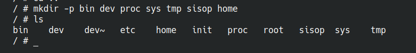

### Soal 3

> Budiman lupa, Ia harus membuat sistem operasi ini dengan sistem **Multi User** sesuai permintaan Dosennya. Ia meminta kembali kepadamu untuk membantunya membuat beberapa user beserta directory tiap usernya dibawah directory `home`. Buat pula password tiap user-usernya dan aplikasikan dalam sistem operasi tersebut!

> _Budiman forgot that he needs to create a **Multi User** system as requested by the lecturer. He asks your help again to create several users and their corresponding home directories under the `home` directory. Also set each user's password and apply them in the OS!_

**Format:** `user:pass`

```
root:Iniroot
Budiman:PassBudi
guest:guest
praktikan1:praktikan1
praktikan2:praktikan2
```

**Answer:**

- **Code:**

  make user directory inside home using `sudo mkdir guest Budiman praktikan1 praktikan2` if compiled without being is sudo bash mode

  ./etc `psswd` file
  ```
  root:hash:0:0:root:/root:/bin/sh
  user1:hash:1001:100:user1:/home/user1:/bin/sh
  Budiman:hash:1002:101:Budiman:/home/user1:/bin/sh
  guest:hash:1003:102:guest:/home/guest:/bin/sh
  praktikan1:hash:1004:103:praktikan1:/home/praktikan1:/bin/sh
  praktikan2:hash:1005:104:praktikan2:/home/praktikan2:/bin/sh

- **Explanation:**

  Using `openssl passwd -1 psswd` to generate hash pasword to make the psswd file inside `osboot/myramdisk/etc`

- **Screenshot:**

  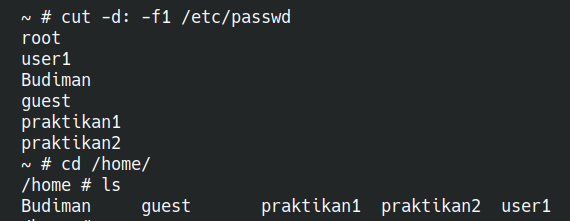

### Soal 4

> Dosen meminta Budiman membuat sistem operasi ini memilki **superuser** layaknya sistem operasi pada umumnya. User root yang sudah kamu buat sebelumnya akan digunakan sebagai superuser dalam sistem operasi milik Budiman. Superuser yang dimaksud adalah user dengan otoritas penuh yang dapat mengakses seluruhnya. Akan tetapi user lain tidak boleh memiliki otoritas yang sama. Dengan begitu user-user selain root tidak boleh mengakses `./root`. Buatlah sehingga tiap user selain superuser tidak dapat mengakses `./root`!

> _The lecturer requests that the OS must have a **superuser** just like other operating systems. The root user created earlier will serve as the superuser in Budiman's OS. The superuser should have full authority to access everything. However, other users should not have the same authority. Therefore, users other than root should not be able to access `./root`. Implement this so that non-superuser accounts cannot access `./root`!_

**Answer:**

- **Code:**

  Add `group` in the home/etc directory
  `wheel:x:10:root`
  By using the following command in myramdisk directory
  ```
  sudo chown root:root root
  sudo chmod 770 root 
  ```
  Then
  `find . | cpio -oHnewc | gzip > ../myramdisk.gz`

- **Explanation:**

  `wheel:x:10:root` is used to manage superuser, here, only root may use sudo. `chown 770` ./ changed the ownership of the directory ./root to the root user and root group, and set its permissions so that only the owner and members of the group can read, write, and execute the directory. Others will have no permissions.

- **Screenshot:**

  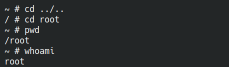 
  
  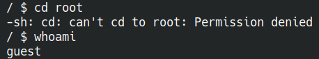
  
  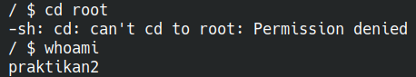  

### Soal 5

> Setiap user rencananya akan digunakan oleh satu orang tertentu. **Privasi dan otoritas tiap user** merupakan hal penting. Oleh karena itu, Budiman ingin membuat setiap user hanya bisa mengakses dirinya sendiri dan tidak bisa mengakses user lain. Buatlah sehingga sistem operasi Budiman dalam melakukan hal tersebut!

> _Each user is intended for an individual. **Privacy and authority** for each user are important. Therefore, Budiman wants to ensure that each user can only access their own files and not those of others. Implement this in Budiman's OS!_

**Answer:**

- **Code:**
  By using the following command in myramdisk with sudo bash
  ```
  chown Budiman:users home/Budiman
  chown praktikan1:users home/praktikan1
  chown praktikan2:users home/praktikan2
  chown guest:users home/guest

  chmod 700 home/Budiman
  chmod 700 home/guest
  chmod 700 home/praktikan1
  chmod 700 home/praktikan2
  ```

- **Explanation:**

  `chown` set the directory ownership, by going over with each resprective home directory and combined with `chmod 700` ensure the owner has full access while others have no access at all.

  it is possible if it shows `chown: invalid user: ‘Budiman:users’` since user Budiman does not exist in the host OS. So use its `UID:GID` instead.

- **Screenshot:**

  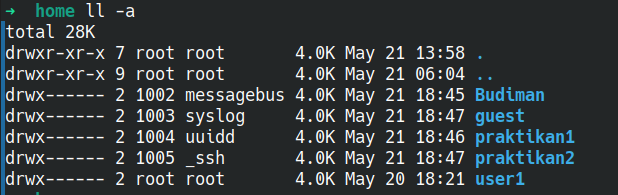

### Soal 6

> Dosen Budiman menginginkan sistem operasi yang **stylish**. Budiman memiliki ide untuk membuat sistem operasinya menjadi stylish. Ia meminta kamu untuk menambahkan tampilan sebuah banner yang ditampilkan setelah suatu user login ke dalam sistem operasi Budiman. Banner yang diinginkan Budiman adalah tulisan `"Welcome to OS'25"` dalam bentuk **ASCII Art**. Buatkanlah banner tersebut supaya Budiman senang! (Hint: gunakan text to ASCII Art Generator)

> _Budiman wants a **stylish** operating system. Budiman has an idea to make his OS stylish. He asks you to add a banner that appears after a user logs in. The banner should say `"Welcome to OS'25"` in **ASCII Art**. Use a text to ASCII Art generator to make Budiman happy!_ (Hint: use a text to ASCII Art generator)

**Answer:**

- **Code:**
  **Option 1**
  Make sure all user have access to os_banner
  `chmod 644 myramdisk/etc/os_banner`
  
  Insert this:
  `cat /etc/os_banner`

  In to each user:
  `nano myramdisk/home/user/.bashrc`

  Dont forget to insert `. ~/.bashrc` to run bashrc
  `nano myramdisk/home/user/.profile `

  **option 2**
  `etc/profile`
  ```bash
  if [ -f /etc/os_banner ]; then
  cat /etc/os_banner
  fi

  ```

- **Explanation:**

  **Option 1**
  `Insert the premade banner into os_banner in etc directory. Then make sure all user can access the file. Insert script cat os_banner into each .bashrc file. Make sure to run the bash file in .profile too. You may need to use sudo bash here, or just add sudo before any script.`

  **Option 2**
  `Make profile file on etc, this file will be called everytime a user logs in`

  Problem:
  `The QEMU TTY uses a fixed-size VGA font, and some ASCII art made for nicer terminal fonts (like JetBrains Mono) may not render correctly.`

- **Screenshot:**

  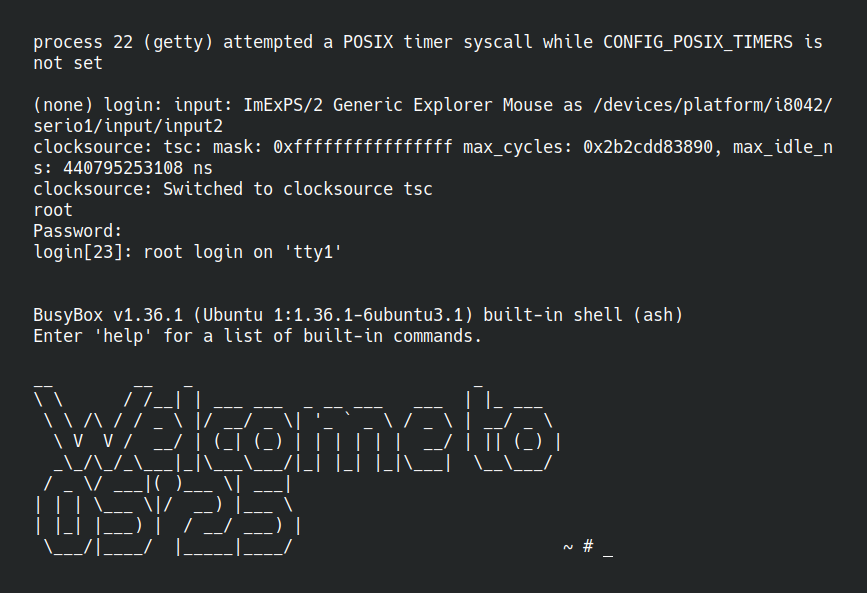
  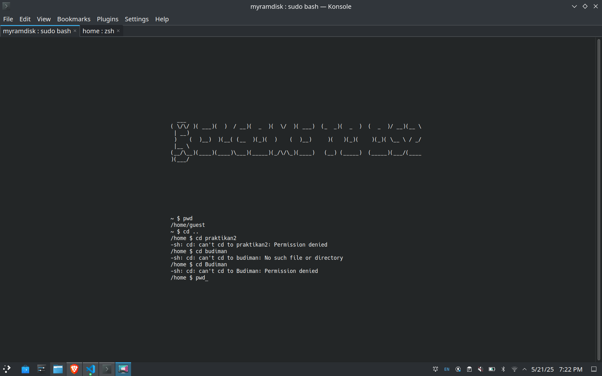

### Soal 7

> Melihat perkembangan sistem operasi milik Budiman, Dosen kagum dengan adanya banner yang telah kamu buat sebelumnya. Kemudian Dosen juga menginginkan sistem operasi Budiman untuk dapat menampilkan **kata sambutan** dengan menyebut nama user yang login. Sambutan yang dimaksud berupa kalimat `"Helloo %USER"` dengan `%USER` merupakan nama user yang sedang menggunakan sistem operasi. Kalimat sambutan ini ditampilkan setelah user login dan setelah banner. Budiman kembali lagi meminta bantuanmu dalam menambahkan fitur ini.

> _Seeing the progress of Budiman's OS, the lecturer is impressed with the banner you created. The lecturer also wants the OS to display a **greeting message** that includes the name of the user who logs in. The greeting should say `"Helloo %USER"` where `%USER` is the name of the user currently using the OS. This greeting should be displayed after user login and after the banner. Budiman asks for your help again to add this feature._

**Answer:**

- **Code:**
  
  `etc/profile`

  ```echo "Helloo $USER"```

- **Explanation:**

  `Add the above code in each profile file, just like adding the os_banner.`

- **Screenshot:**

  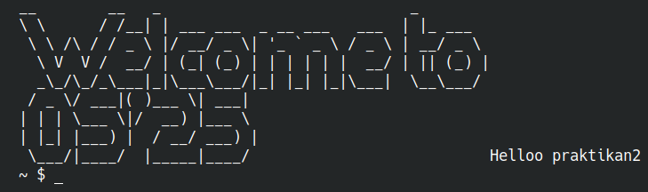

### Soal 8

> Dosen Budiman sudah tua sekali, sehingga beliau memiliki kesulitan untuk melihat tampilan terminal default. Budiman menginisiatif untuk membuat tampilan sistem operasi menjadi seperti terminal milikmu. Modifikasilah sistem operasi Budiman menjadi menggunakan tampilan terminal kalian.

> _Budiman's lecturer is quite old and has difficulty seeing the default terminal display. Budiman takes the initiative to make the OS look like your terminal. Modify Budiman's OS to use your terminal appearance!_

**Answer:**

- **Code:**
  `test.sh` in ./
  ```bash
  #!/bin/sh

  set_prompt_color() {
    USERNAME=$1
    COLOR=$2

    if [ -d "$USERNAME" ]; then
      echo "export PS1='\\[\\e[${COLOR}m\\]\\u:\\w\\$\\[\\e[0m\\] '" > "$USERNAME/.bashrc"
      echo "if [ -f ~/.bashrc ]; then" > "$USERNAME/.profile"
      echo "    . ~/.bashrc" >> "$USERNAME/.profile"
      echo "fi" >> "$USERNAME/.profile"
    fi
  }

  # Assign colors
  set_prompt_color home/Budiman "32"        # green
  set_prompt_color home/guest "34"          # blu
  set_prompt_color home/praktikan1 "33"     # kuning
  set_prompt_color home/praktikan2 "36"     # cyan
  set_prompt_color root "35"     # purple


  echo "Connected Successfully ;D"

  ```

- **Explanation:**

  `Adding export PS1 into each user bash with different color is repetitive. Using function make it easier to manage. Make .bashrc file in user folder. Inside, set prompt with color.`
  `on .bashrc \u:\w\$ show username and path, then \e[COLORm choose user color.`

- **Screenshot:**

  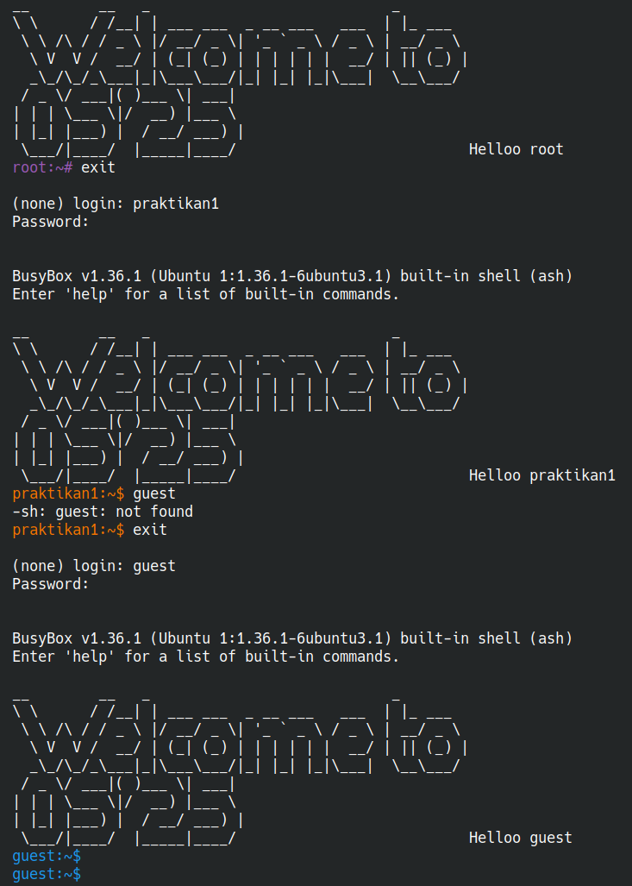

  
### Soal 9

> Ketika mencoba sistem operasi buatanmu, Budiman tidak bisa mengubah text file menggunakan text editor. Budiman pun menyadari bahwa dalam sistem operasi yang kamu buat tidak memiliki text editor. Budimanpun menyuruhmu untuk menambahkan **binary** yang telah disiapkan sebelumnya ke dalam sistem operasinya. Buatlah sehingga sistem operasi Budiman memiliki **binary text editor** yang telah disiapkan!

> _When trying your OS, Budiman cannot edit text files using a text editor. He realizes that the OS you created does not have a text editor. Budiman asks you to add the prepared **binary** into his OS. Make sure Budiman's OS has the prepared **text editor binary**!_

**Answer:**

- **Code:**

  Clone **binary** repository:
  `git clone https://github.com/morisab/budiman-text-editor.git`

  Compile and test binary `g++ -static -o binary main.cpp `

  `cp binary ~/osboot/myramdisk/bin`

- **Explanation:**

  `After cloning, compiling, and testing. Copy the binary file into Budiman OS bin directory.`

- **Screenshot:**

  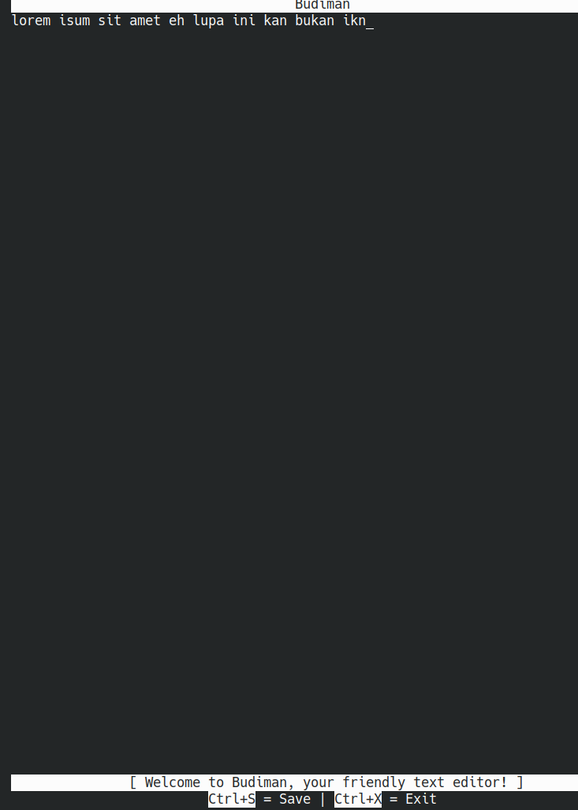

  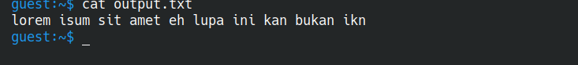

### Soal 10

> Setelah seluruh fitur yang diminta Dosen dipenuhi dalam sistem operasi Budiman, sudah waktunya Budiman mengumpulkan tugasnya ini ke Dosen. Akan tetapi, Dosen Budiman tidak mau menerima pengumpulan selain dalam bentuk **.iso**. Untuk terakhir kalinya, Budiman meminta tolong kepadamu untuk mengubah seluruh konfigurasi sistem operasi yang telah kamu buat menjadi sebuah **file .iso**.

> After all the features requested by the lecturer have been implemented in Budiman's OS, it's time for Budiman to submit his assignment. However, Budiman's lecturer only accepts submissions in the form of **.iso** files. For the last time, Budiman asks for your help to convert the entire configuration of the OS you created into a **.iso file**.

**Answer:**

- **Code:**

  In osboot directory:
  `mkdir -p mylinuxios/boot/grub`

  `grub.cfg`
  ```bash
  set timeout=5
  set default=0

  menuentry "MyLinux" {
      linux /boot/bzImage init=/init console=ttyS0
      initrd /boot/myramdisk.gz
  }
  ```
  In osboot directory:
  `grub-mkrescue -o mylinux.iso mylinuxiso`

  Run using:
  `qemu-system-x86_64 -cdrom mylinux.iso -m 256 -nographic -serial mon:stdio`

- **Explanation:**

  `put your answer here`

- **Screenshot:**

  

---

Pada akhirnya sistem operasi Budiman yang telah kamu buat dengan susah payah dikumpulkan ke Dosen mengatasnamakan Budiman. Kamu tidak diberikan credit apapun. Budiman pun tidak memberikan kata terimakasih kepadamu. Kamupun kecewa tetapi setidaknya kamu telah belajar untuk menjadi pembuat sistem operasi sederhana yang andal. Selamat!

_At last, the OS you painstakingly created was submitted to the lecturer under Budiman's name. You received no credit. Budiman didn't even thank you. You feel disappointed, but at least you've learned to become a reliable creator of simple operating systems. Congratulations!_
